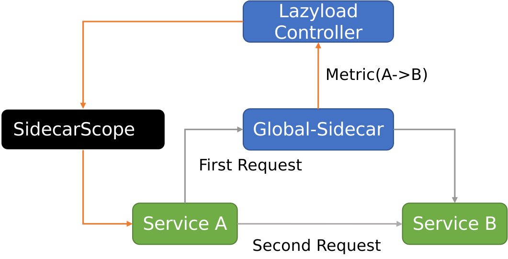
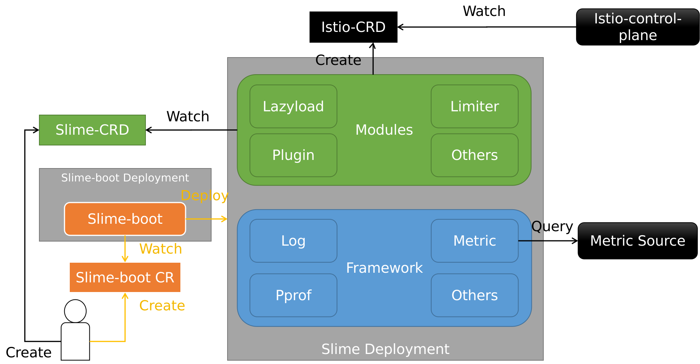

- [一、导读](#一导读)
- [二、框架层演进](#二框架层演进)
- [三、懒加载模块发展](#三懒加载模块发展)
  - [3.1 架构升级](#31-架构升级)
  - [3.2 静态配置增强](#32-静态配置增强)
- [四、智能限流模块发展](#四智能限流模块发展)
- [五、其他变化](#五其他变化)
- [六、展望](#六展望)


## 一、导读

我们团队很早就开始使用 Istio 做服务网格。在实践过程中，我们开发了很多 Istio 周边模块，方便了自身及集团内部客户使用 Istio 。为了回馈社区，我们系统整理了这些模块，并选择了一部分模块，在2021年初开源出 Slime 项目。Slime 项目旨在解决 Isito 使用上的痛点，方便用户使用 Istio 的高级功能，并始终坚持**可以无缝对接Istio，无需任何的定制化改造**的原则，极大降低了使用门槛。

这一年多来，我们沿着当初的目标稳步发展，在架构、功能、工程角度做了很多变化和尝试，进一步提升了能力，并且在2021年12月受邀加入 Istio 生态，正式成为 [Istio Ecosystem - integrations](https://istio.io/latest/about/ecosystem/) 的成员。

今天，本文将会全面介绍现阶段 Slime 的能力，以懒加载和智能限流模块为主，并展望未来发展，希望能让更多的 ServiceMesher 了解 Slime，参与 Slime，一起更愉快地使用服务网格。


## 二、懒加载

### 2.1 背景

Istio 的全量推送，是所有 Istio 建设者绕不开的问题。

众所周知，早期 Istio 的配置下发非常粗糙，直接全量推送。这意味着，随着服务网格中业务规模的不断扩大，控制面需要下发的内容越来越多，数据面需要接收的内容也不断增长，这必然带来性能问题。而且集群中往往有多个业务系统。一个业务系统的应用感知所有业务系统的配置，这也是不合理的。

于是，Istio 1.1版本提供了解决方案 - SidecarScope。用户可以在 SidecarScope 中描述 SidecarProxy 需要关心的服务信息，借此屏蔽无关的服务配置下发。一个典型的 SidecarScope 样例如下，样例表示允许匹配的 SidecarProxy 感知 namespace prod1 和 istio-system 中的所有服务以及 prod2中的 ratings 服务配置信息。

```yaml
apiVersion: networking.istio.io/v1alpha3
kind: Sidecar
metadata:
  name: default
  namespace: prod1
spec:
  egress:
  - hosts:
    - "prod1/*"
    - "prod2/ratings.prod2.svc.cluster.local"
    - "istio-system/*"
```

Istio 提供的 SidecarScope 确实可以实现服务配置的精确管理，从而坚决全量配置下发的性能问题。但是在实施过程中，手动管理 SidecarScope 却很难推行。一方面是服务依赖的信息不好整理，另一方面一旦配置有误，会导致调用出现问题。我们迫切希望能够更智能地管理 SidecarScope。


### 2.2 登场

懒加载（Slime/Lazyload）模块就是用于解决这个问题，其核心价值是帮助业务人员既使用 SidecarScope，又无需直接管理 SidecarScope。

我们认为，服务依赖关系可以分成运行过程中不断变化的动态服务依赖和业务人员可以提前感知的静态服务依赖关系两类。对于动态依赖，我们设计了一套体系，实时感知服务依赖关系并修改 SdiecarScope。对于静态依赖，我们着重简化了配置规则，使其更加人性化。


### 2.3 动态配置获取

懒加载包含 Global-sidecar 和 Lazyload Controller 两个组件。

- Global-sidecar: 兜底组件，当源服务无法找到目标服务时，进行兜底转发，并生成相应的服务依赖 Metric
- Lazyload Controller: 控制组件，处理 Global-sidecar 上报的 Metric，修改源服务的 SidecarScope，为其增加相应配置

简化流程如下所示





- 服务A的 SidecarScope 初始是空白，没有服务B的配置信息
- 服务A发起对服务B的第一次访问，由于服务A的 SidecarProxy 没有服务B的配置信息，请求发送到兜底组件 Global-Sidecar
- 兜底组件 Global-Sidecar 拥有全量服务配置信息，自然包含服务B的，实现转发，首次请求访问成功。同时生成 Metric(A->B)
- Lazyload Controller感知到 Metric(A->B)，修改 SidecarScope A，为其增加B的配置
- 服务A第二次访问服务B时，服务A的 SidecarProxy 已经有B的配置信息，请求直接到达服务B


懒加载模块可以实现**按照网格治理规则实现兜底转发首次请求，并按需实时配置SidecarScope**。我们引入了ServiceFence这一Slime CRD，它决定了对应的SidecarScope的内容。

懒加载一直是大家比较关注的Slime模块，我们也针对懒加载进行了许多提升。下面主要介绍下这些提升中比较有代表性的两个，懒加载的架构升级和静态配置增强。


### 3.1 架构升级

下面是懒加载升级前的架构。


对照上面的懒加载核心流程图，之前的懒加载模块的三个问题，我称之为“1-2-3”，即

- 一个依赖：Lazyload Controller只支持查询Prometheus metric。这意味着懒加载模块强依赖Prometheus。
- 两个版本：兜底组件由global-sidecar-pilot和global-sidecar组成。global-sidecar是一个独立运行的sidecar proxy，负责兜底。global-sidecar-pilot是一个定制化的Pilot，作用是基于集群原有Pilot的配置添加定制化逻辑，输出给global-sidecar，保证global-sidecar可以正常兜底。问题是，global-sidecar-pilot并不一定和集群原有Pilot的版本保持一致。global-sidecar也和其他sidecar proxy版本不一致。这意味着，集群中可能存在两个版本的控制面、数据面，存在数据兼容性隐患。
- 三类组件：因为兜底组件由global-sidecar-pilot和global-sidecar组成，所以相比理想的懒加载架构，这个版本的懒加载一共有global-sidecar-pilot，global-sidecar和lazyload controller三类组件。在这个版本推荐的懒加载namespace部署模式下，每个namespace中需要部署⼀个global-sidecar。再考虑集群唯⼀的lazyload controller，global-sidecar-pilot。对于N个namespace，需要N+2个Deployment，资源开销是O(N)。

针对上面的问题，我们着重从去除强依赖、统一版本、精简组件的角度进行了架构升级。现在新的懒加载架构示意图如下


可以对应的总结为“0-1-2”，即

- 零个依赖：新增支持以accesslog作为metric source，直接从global-sidecar的accesslog中获取服务依赖关系，不再强依赖Prometheus。当然，仍然支持以Prometheus作为metric source。
- 一个版本：去除了global-sidecar-pilot组件。global-sidecar由sidecar proxy改造成普通应⽤（包含了访问⽬标转换的处理逻辑），由业务集群Pilot注⼊版本⼀致的sidecar proxy。既去除了定制化的Pilot，⼜摆脱了对sidecar proxy版本的要求，彻底解决兼容性问题。
- 两类组件：组件种类只有global-sidecar和lazyload controller。在这个版本推荐的懒加载cluster部署模式下，每个集群只需要lazyload controller和global-sidecar两个deployment。对于N个namespace资源开销从O(N) 降低到 O(1)。

至此，懒加载的架构基本确定下来。


### 2.4 静态配置增强

懒加载前期的发展，我们一直聚焦于服务依赖关系的获取，就像前文懒加载核心流程图所示的那样，更多考虑的是如何获取metric、修改SidecarScope。其实是**动态服务依赖关系**的处理。但在与内外部一些用户的交流过程中，我们发现用户出于安全可控的现实考虑，往往希望提前指定一些服务依赖关系，直接配置到SidecarScope中，即**静态服务依赖关系**。

这似乎又回到了手动修改SidecarScope的老路，但实则不然。我们现在拥有ServiceFence（Slime CRD）的帮助，以及动态修改SidecarScope的完善流程。于是，可以从静态服务依赖关系抽象出**静态服务依赖规则**，将这些规则写入ServiceFence。之后Lazyload Controller只需要按部就班的根据这些规则自动找出匹配的服务，更新SidecarScope即可。从手动修改SidecarScope，变成手动修改ServiceFence，想象的空间打开了。

现在我们已经提供的静态配置规则有三类：

- 依赖某些namespace所有服务
- 依赖具有某些label的所有服务
- 依赖某个特定服务

终于，同学们不用在上线前反复确认，新上线服务的SidecarScope是否确实填齐了那长长的依赖服务列表，更不用在下次被突然告知依赖的系统有服务变更时，赶过来修改自己的SidecarScope，配置一个简单的ServiceFence就可高枕无忧。

下面举个例子，微服务系统往往都有一些共性的label，假如依赖的一个系统都有label `system: foo`，依赖的另一个系统都有label `system: bar`和`owner: bob`，那依赖这两个服务系统的ServiceFence就是这样

```yaml
---
apiVersion: microservice.slime.io/v1alpha1
kind: ServiceFence
metadata:
  name: my-service
  namespace: my-ns
spec:
  enable: true
  labelSelector: # Match service label, multiple selectors are 'or' relationship
    - selector:
        system: foo
    - selector: # labels in one selector are 'and' relationship
        system: bar
        owner: bob
```

看起来，是不是清爽极了。

这块的内容详见[懒加载教程 - 静态服务依赖关系添加](https://github.com/slime-io/lazyload/blob/master/lazyload_tutorials_zh.md#%E9%9D%99%E6%80%81%E6%9C%8D%E5%8A%A1%E4%BE%9D%E8%B5%96%E5%85%B3%E7%B3%BB%E6%B7%BB%E5%8A%A0)。


## 三、智能限流

智能限流模块是Slime中另一个比较受大家关注的模块。在服务网格中，为了配置限流规则，用户不得不面对复杂的EnvoyFilter配置，为了解决这个问题，我们们推出了智能限流模块，其对应的Slime CRD是`SmartLimiter`。

在之前开源的版本中，我们主要提供了两种场景的限流能力：

- 本地限流：替服务的每个Pod设置固定的限流数值
- 全局均分限流：根据用户设置的总的限流数，自动根据后端Pod数，算出每个Pod的限流数值

以上两种场景是比较基础，也是大家用到较多的场景。其实全局均分限流，就是本地限流叠加Pod数感知的一个进阶版，实现方式类似，底层都是依赖Envoy插件`envoy.filters.http.local_ratelimit`提供的限流能力。想做出全面的智能限流模块，我们需要挑战看起来更加智能的全局共享限流场景。最终新版本的限流模块架构如下


红色是本地限流，绿色是全局均分限流，而蓝色就是最新实现的全局共享限流。

全局共享限流功能替服务的所有Pod维护了一个全局计数器，底层依赖的是Envoy插件`envoy.filters.http.ratelimit`提供的限流能力和RLS服务提供给的全局计数能力。

当提交一个全局共享限流SmartLimiter后，Limiter模块会根据其内容生成EnvoyFilter和名为`slime-rate-limit-config`的ConfigMap。EnvoyFilter会被Istio监听到，下发限流配置至SidecarProxy，而ConfigMap则会被挂载到RLS服务，RLS根据ConfigMap内容生成全局共享计数器。

诚然，目前受限于工作链路的增加，全局共享限流的性能比不上全局均分限流，但这种能力在一些非性能敏感场景下是有实践可能性的。我们也会继续关注这块的未来优化可能。


## 四、框架层

Slime项目在开源之初是一个单体的项目，分为Operator，Controller，Metric三个部分，初期的架构如下图所示


具体来说

- Operator部分名字是Slime-boot，作用是监听用户创建的kind为`SlimeBoot`的CR资源，读取用户定义的Slime配置信息，拉起相应的模块
- Controller部分是诸如Lazyload，Limiter之类的具体模块。每个模块都有自己专注的Slime CRD，彼此功能不重叠
- Metric部分又称Slime-metric，主要负责从metric source处（比如Prometheus）获取metric，供Controller中各模块使用

可以看出，三层架构中，Operator和Metric的能力是比较单一的，真正的扩展性体现在Controller中不同的模块。把这么多功能层次放在一个代码仓库中，不同层次的耦合很深，不利于开发扩展。因此，我们本着“高内聚，低耦合”的设计思想，进行了架构大调整。新的架构如下图所示





仍然是三个层次，Slime-boot的定位没有太大变化，封装了一个Helm Operator，用于根据`Slimeboot` CR，拉起Framework和指定的Modules。

不同的是，我们把Metric扩展为可以提供更多能力的Framework层。**整个Framework层的定位是提供模块需要的共性能力**，让模块专注于自身独有的业务逻辑，从而划清了Modules和Framework的边界，做到低耦合。

这样带来的好处是，我们可以从Modules和Framework两个层次进行演进，实现高内聚。

- Framework层次，专注于基础能力提升。除了原先的metric query能力，还提供了标准化的日志能力、pprof数据查询能力、自定义api接口、健康检查等
- Modules层次，专注于标准模块的抽象。我们基于CRD Operator模式，定义了一个Slime Module应该是什么样，并相应开发出了Slime-builder脚手架，可以一键生成标准模块。

由此，我们将Slime的代码仓库分成1+N：Slime-boot和Framework继续沿用之前的slime-io/slime仓库，Lazyload等模块全部单独创建仓库。至此解决了之前代码开发“牵一发动全身”的痛苦。

上下层标准化后的另一个好处是，部署形式上的聚合。既然所有模块的依赖，一个Framework就可以解决，模块彼此之间又互不干扰，那部署形式自然也可以是1+N的，即一个Slime Deployment包含一个公用的Framework层和用户想要的N个模块。这有点类似于宿主机上的多个Docker容器。

至于想要哪些模块，可以通过Slime-boot CR指定，由Slime-boot Deployment拉起自定义的Slime Deployment。实际上，Slime Deployment中一个模块也可以拉起多个，带上不同的Revision标签，比如Lazyload-v1和Lazyload-v2，使用方式类似于Istio Revision。


## 五、其他变化

上面几个章节，以四个例子简要介绍了Slime在过去一年的一些亮点变化。其他方面的一些变化还包括

- 重构Slime-metric，将其真正标准化为Framework层的基础能力
- 引入E2E测试，建设Slime的质量保证工程
- 重新编写[官方教程](https://github.com/slime-io/slime/blob/master/README_ZH.md#%E6%95%99%E7%A8%8B)，包含丰富的概念介绍和使用样例
- 搭建了[Slime Blog](https://slime-io.github.io/)，后续的相关博客、Release-notes等都会更新在上面


## 六、展望

最后，关于Slime的未来发展方向，还是在于已有模块的提升和新模块的引入两方面。

对于前者，一个重点是懒加载易用性完善。比较确定的内容有支持一键自动纳管整个服务网格、提供更高灵活度的静态服务依赖配置能力、支持更多协议的服务懒加载，探索性的内容比如跨集群的服务懒加载。另一个重点是限流能力的丰富，比较确定的内容有出流量侧限流支持、支持更多协议的服务限流。

对于后者，我们目前已经在内部孵化的一些新模块，功能主要涉及服务网格的全链路自动化运维、服务网格的无感热升级、好用的服务网格黑屏半命令行半图形化工具等。

希望上面的这些新内容能尽快与大家见面，也欢迎大家多多交流，多多关注Slime。


