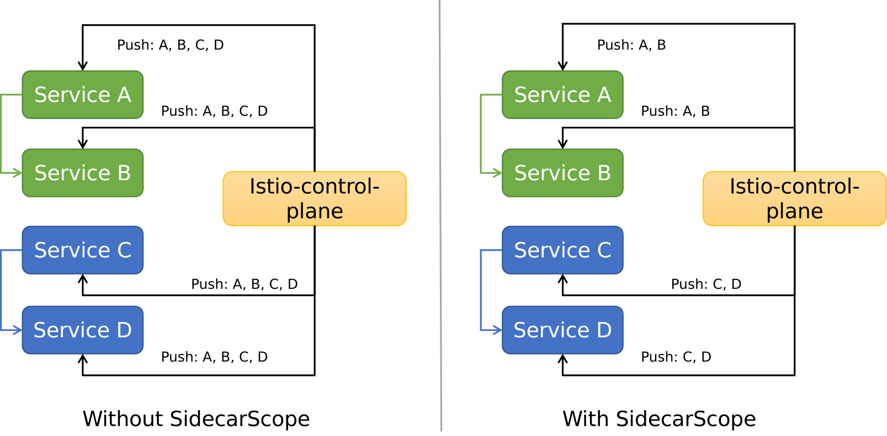
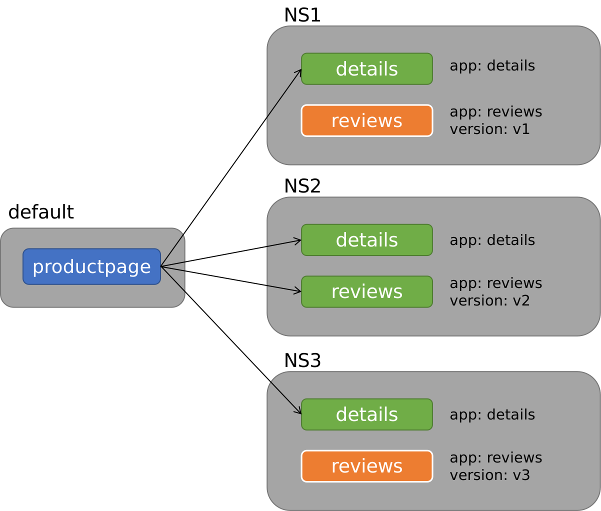
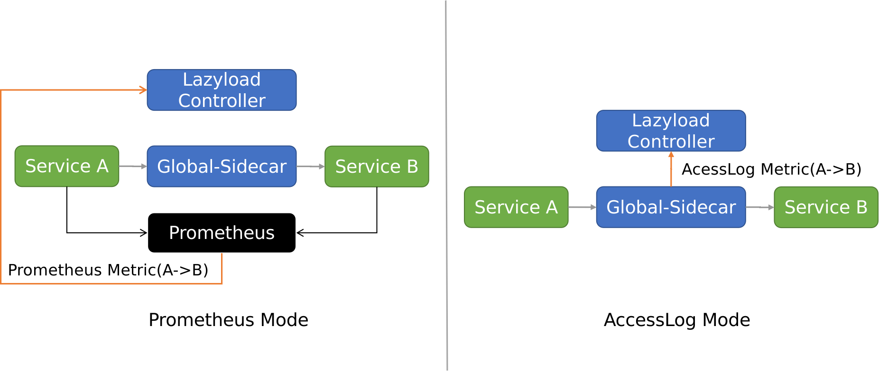

- [一、导读](#一导读)
- [二、懒加载](#二懒加载)
  - [2.1 背景](#21-背景)
  - [2.2 价值](#22-价值)
  - [2.3 动态配置更新](#23-动态配置更新)
  - [2.4 静态配置增强](#24-静态配置增强)
  - [2.5 Metric类型](#25-metric类型)
  - [2.6 使用模式](#26-使用模式)
- [三、智能限流](#三智能限流)
  - [3.1 背景](#31-背景)
  - [3.2 价值](#32-价值)
  - [3.3 实现](#33-实现)
  - [3.4 本地限流](#34-本地限流)
  - [3.5 全局均分限流](#35-全局均分限流)
  - [3.6 全局共享限流](#36-全局共享限流)
  - [3.7 自适应限流](#37-自适应限流)
- [四、项目架构](#四项目架构)
- [五、展望](#五展望)
  - [5.1 懒加载规划](#51-懒加载规划)
  - [5.2 智能限流规划](#52-智能限流规划)
  - [5.3 新模块规划](#53-新模块规划)


## 一、导读

网易数帆轻舟微服务团队很早就开始使用 Istio 做服务网格。在实践过程中，我们开发了很多 Istio 周边模块，方便了自身及网易集团内部客户使用 Istio 。为了回馈社区，我们系统整理了这些模块，并选择了一部分，在2021年初开源出 [Slime 项目](https://github.com/slime-io/slime)。


Slime 项目旨在解决 Istio 使用上的痛点，方便用户使用 Istio 的高级功能，并始终坚持**可以无缝对接Istio，无需任何的定制化改造**的原则，极大降低了使用门槛。

这一年多来，Slime 在架构、功能、工程方面做了很多变化和尝试，得到了很大提升，并且在2021年12月受邀加入 Istio 生态，正式成为 [Istio Ecosystem - integrations](https://istio.io/latest/about/ecosystem/#integrations) 的成员。

今天，本文将会介绍 Slime 现阶段的主要能力，以懒加载和智能限流模块为主，并展望未来发展，希望能让更多的 ServiceMesher 了解 Slime，参与 Slime，一起更轻松地使用服务网格。


## 二、懒加载

### 2.1 背景

Istio 的全量推送性能问题，是所有 Istio 使用者都要面对的问题。

众所周知，早期 Istio 的配置下发非常粗糙，直接全量推送。这意味着，随着服务网格中业务规模的不断扩大，控制面需要下发的内容越来越多，数据面需要接收的内容也不断增长，这必然带来性能问题。集群中往往有多个业务系统。一个业务系统的应用感知所有业务系统的配置，这意味着推送大量冗余配置，也是不合理的。如下图左侧所示，A 只和 B 有关系，却被推送了 C 和 D 的配置。 另一个问题是，推送的频率会很高。当一个服务发生变化，控制面要通知数据面所有SidecarProxy。




于是，Istio 1.1版本提供了解决方案 - Sidecar CRD （本文会称之为 SidecarScope，以和 Envoy 实现的 SidecarProxy 做区分）。用户可以在 SidecarScope 中描述 SidecarProxy 需要关心的服务信息，借此屏蔽无关的服务配置下发。结果如上图右侧所示，服务配置了 SidecarScope 后，收到的配置精简了，不再包含无关的配置。同时，不相关服务的配置变化也不会再通知，减少了推送频率。

一个典型的 SidecarScope 样例如下，样例表示允许匹配的 SidecarProxy 感知 Namespace prod1 和 istio-system 中的所有服务以及 Namespace prod2中 ratings 服务配置信息。

```yaml
apiVersion: networking.istio.io/v1alpha3
kind: Sidecar
metadata:
  name: default
  namespace: prod1
spec:
  egress:
  - hosts:
    - "prod1/*"
    - "prod2/ratings.prod2.svc.cluster.local"
    - istio-system/*
```

Istio 提供的 SidecarScope 可以解决配置全量下发的问题，看起来问题解决了。但是在实践中，手动管理 SidecarScope 很困难。一方面是服务依赖的信息不好整理，另一方面一旦配置有误，会导致调用出现问题。这非常不利于服务网格大规模落地。我们迫切希望能够更智能地管理 SidecarScope。


### 2.2 价值

[懒加载模块](https://github.com/slime-io/lazyload)就是用于解决上述问题。懒加载可**自动对接服务网格，在转发过程中支持 Istio 所有网络治理能力，无性能问题**。它可以帮助业务人员使用了 SidecarScope，而无需直接管理它。

我们认为，服务依赖关系可以分成运行过程中不断变化的动态服务依赖和业务人员可以提前知晓的静态服务依赖两类。对于动态依赖，我们设计了一套机制，实时获取服务依赖并修改 SidecarScope ；对于静态依赖，我们着重简化了配置规则，使其更加人性化。


### 2.3 动态配置更新

懒加载包含 Global-sidecar 和 Lazyload Controller 两个组件。

- Global-sidecar: 兜底组件，当源服务无法找到目标服务时，进行兜底转发，并生成相应的服务依赖 Metric
- Lazyload Controller: 控制组件，处理 Global-sidecar 上报的 Metric，修改源服务的 SidecarScope，为其增加相应配置

简化的动态配置更新流程如下所示


- 服务 A 的 SidecarScope 初始是空白，没有服务 B 的配置信息
- 服务 A 发起对服务 B 的第一次访问，由于服务 A 的 SidecarProxy 没有服务 B 的配置信息，请求发送到兜底组件 Global-Sidecar
- 兜底组件 Global-Sidecar 拥有全量服务配置信息，自然包含服务 B ，转发请求到服务 B，首次请求成功，并生成 Metric(A->B)
- Lazyload Controller 感知到 Metric(A->B) ，修改 SidecarScope A，为其增加服务 B 的配置
- 服务 A 第二次访问服务 B 时，服务 A 的 SidecarProxy 已经有服务 B 的配置，请求直达服务 B


详细的流程图如下


其中 ServiceFence 是懒加载中引入的 CRD，作用是存储与服务相关的 Metric，实现 SidecarScope 的更新。详细的介绍可参考 [懒加载教程-架构](https://github.com/slime-io/lazyload/blob/master/lazyload_tutorials_zh.md#%E6%9E%B6%E6%9E%84)


### 2.4 静态配置增强

懒加载发展早期，我们聚焦于动态服务依赖关系的获取，这看起来智能又省心。然而在实践中，我们发现很多用户出于安全考虑，往往希望直接配置一些规则到 SidecarScope 中，即配置静态服务依赖关系。于是，我们开始思考如何灵活配置静态依赖关系。

于是，我们设计出一套很好用的静态规则，并将其写到 ServiceFence 中（是的，就是动态配置更新中用于存储 Metric 的 CRD，它在这里发挥了新作用）。之后 Lazyload Controller 根据这些规则更新相应的 SidecarScope 。

现在我们提供的静态配置规则有三类：

- 依赖某些 Namespace 所有服务
- 依赖具有某些 label 的所有服务
- 依赖某个特定服务

此处以 label 匹配举个例子，假如应用部署如下图所示



现在为服务 productpage 启用懒加载，已知 productpage 的依赖规则为

- 具有 label `app: details`的所有服务
- 具有 label `app: reviews ` 与`version: v2`的所有服务

那么对应的 ServiceFence 写法如下

```yaml
---
apiVersion: microservice.slime.io/v1alpha1
kind: ServiceFence
metadata:
  name: productpage
  namespace: default
spec:
  enable: true
  labelSelector: # Match service label, multiple selectors are 'or' relationship
    - selector:
        app: details
    - selector: # labels in one selector are 'and' relationship
        app: reviews
        version: v2
```

Lazyload Controller 会根据实际匹配结果，填充 SidecarScope。 实际得到的 SidecarScope 如下，上图中绿色的服务全部选中

```yaml
apiVersion: networking.istio.io/v1beta1
kind: Sidecar
metadata:
  name: productpage
  namespace: default
spec:
  egress:
  - hosts:
    - '*/details.ns1.svc.cluster.local'
    - '*/details.ns2.svc.cluster.local'
    - '*/details.ns3.svc.cluster.local'
    - '*/reviews.ns2.svc.cluster.local'
    - istio-system/* # istio部署的ns
    - mesh-operator/* # lazyload部署的ns
  workloadSelector:
    labels:
      app: productpage
```


终于，我们不用在上线前反复确认，是否填齐了所有服务依赖，更不用在服务依赖关系变更时，手动修改 SidecarScope。配置两三条 ServiceFence 的规则就可搞定一切。

详细的介绍可参考 [懒加载教程 - 静态服务依赖关系添加](https://github.com/slime-io/lazyload/blob/master/lazyload_tutorials_zh.md#%E9%9D%99%E6%80%81%E6%9C%8D%E5%8A%A1%E4%BE%9D%E8%B5%96%E5%85%B3%E7%B3%BB%E6%B7%BB%E5%8A%A0)


### 2.5 Metric类型

在2.3章节中，我们解释了 Metric 是动态依赖关系生成的根本。目前懒加载支持的 Metric 类型有两个：Prometheus 和 AccessLog 。



使用 Prometheus Mode，指标由各个业务应用的 SidecarProxy 产生。Lazyload Controller 查询 Prometheus 获取指标。此模式需要服务网格对接 Prometheus。

使用 AccessLog Mode，指标来源是 Global-sidecar 的 AccessLog。Global-sidecar 在兜底转发的同时，会生成固定格式的 AccessLog，发给 Lazyload Controller 进行处理。此模式无需外部依赖，更为轻便。


### 2.6 使用模式

懒加载模块有两种使用模式，Namespace 模式和 Cluster 模式。两种模式中，Lazyload Controller 都是全局唯一的，不同点在于前者的 Global-sidecar 是 Namespace 级别，后者是 Cluster 级别。如下图所示


对于 N 个 Namespace，Namespace 模式的懒加载组件数是 O(N)，Cluster 模式则是 O(1)。现在我们更推荐使用 Cluster 模式。如上图所示，每个集群只需要部署两个 Deployment，简洁明了。

详细的介绍可参考 [懒加载教程 - 安装和使用](https://github.com/slime-io/lazyload/blob/master/lazyload_tutorials_zh.md#%E5%AE%89%E8%A3%85%E5%92%8C%E4%BD%BF%E7%94%A8) 


## 三、智能限流

### 3.1 背景

随着 Istio 移除 Mixer，在服务网格中实现限流变得困难起来。

- 场景少：Envoy 的本地限流组件功能简单，不能实现全局均分、全局共享限流等高阶用法
- 配置复杂：本地限流需要借助 Envoy 内建插件 `envoy.local.ratelimit`，用户不得不面对复杂的 EnvoyFilter 配置
- 条件固定：没有根据资源使用率等实际情况，自动调整限流配置的能力


### 3.2 价值

为了解决这个问题，我们推出了[智能限流模块](https://github.com/slime-io/limiter)。智能限流模块具有很多优势，具体来说

- 场景多：支持本地限流、全局均分限流、全局共享限流
- 配置方便：配置简单，可读性好，无需配置 EnvoyFilter
- 条件自适应：限流触发的条件可结合 Prometheus Metric，动态计算，实现自适应限流效果


### 3.3 实现

我们设计了一个新的CRD - SmartLimiter，其配置规则接近自然语义。模块的逻辑分成两部分

- SmartLimiter Controller 获取监控数据，更新 SmartLimiter CR
- SmartLimiter CR 到 EnvoyFilter 的转换

限流模块架构如下


红色是本地限流，绿色是全局均分限流，而蓝色是全局共享限流。详细的介绍可参考 [智能限流教程 - 架构](https://github.com/slime-io/limiter/blob/master/README_ZH.md#%E6%9E%B6%E6%9E%84) 


### 3.4 本地限流

本地限流是最基础的使用场景。SmartLimiter 替服务的每个 Pod 设置固定的限流数值。底层依赖 Envoy 内建插件 `envoy.local.ratelimit`。标识字段是`action.strategy: single`。

一个样例如下，表示 reviews 服务每个 Pod 的9080端口每分钟限流 60次。

```yaml
apiVersion: microservice.slime.io/v1alpha2
kind: SmartLimiter
metadata:
  name: reviews
  namespace: default
spec:
  sets:
    _base:   # 匹配所有服务，关键词 _base ，也可以是你定义的 subset ，如 v1 
      descriptor:   
      - action:    # 限流规则
          fill_interval:
            seconds: 60
          quota: '100'
          strategy: 'single'  
        condition: 'true'  # 永远执行该限流
        target:
          port: 9080
```


### 3.5 全局均分限流

全局均分限功能根据用户设置的总的限流数，然后平均分配到各个 Pod。底层依赖 Envoy 内建插件 `envoy.local.ratelimit`。标识字段是`action.strategy: average`。

一个样例如下，表示 reviews 服务所有 Pod 的9080端口每分钟一共限流 60次，具体到每个 Pod 的限流次数由 `action.quota`计算得出。

```yaml
apiVersion: microservice.slime.io/v1alpha2
kind: SmartLimiter
metadata:
  name: reviews
  namespace: default
spec:
  sets:
    _base:
      descriptor:
      - action:
          fill_interval:
            seconds: 60
          quota: '100/{{._base.pod}}' # 如果reviews实例数是2,则每个Pod限流每分钟50次
          strategy: 'average'  
        condition: 'true'
        target:
          port: 9080
```


### 3.6 全局共享限流

全局共享限流限制目标服务的所有 Pod 可访问的总次数，不会像全局均分限流限制在平均值，比较适用于访问不均的场景。此场景会维护一个全局计数器，底层依赖 Envoy 插件 `envoy.filters.http.ratelimit`和 RLS 服务提供的全局计数能力。标识字段是`action.strategy: global`。

一个样例如下，表示 reviews 服务所有 Pod 的9080端口每分钟一共限流 60次，不均分到每个 Pod 。

```yaml
apiVersion: microservice.slime.io/v1alpha2
kind: SmartLimiter
metadata:
  name: reviews
  namespace: default
spec:
  sets:
    _base:
      #rls: 'outbound|18081||rate-limit.istio-system.svc.cluster.local' 如果不指定默认是该地址
      descriptor:
      - action:
          fill_interval:
            seconds: 60
          quota: '100'
          strategy: 'global'
        condition: 'true'
        target:
          port: 9080 
```


### 3.7 自适应限流

上述三个场景中，触发限流的条件字段`condition`除了可以是固定数值（true），还可以是 Prometheus Query 的计算结果。后者就是自适应限流。此场景和上述三个场景是交叉关系。

用户可以自定义需要获取的监控指标，比如定义一个handler `cpu.sum`，其数值等于 `sum(container_cpu_usage_seconds_total{namespace="$namespace",pod=~"$pod_name",image=""})`，后面就可以将触发限流的`condition`设置为`{{._base.cpu.sum}}>100` 的形式，实现自适应限流。

一个样例如下，表示 reviews 服务每个 Pod 的9080端口只有当CPU使用值大于100时，每分钟限流 60次。对比3.4中的例子，`condition`不再永远为真，是否触发限流，由 SmartLimiter Controller 根据应用实际状态判断，更加智能化。

```yaml
apiVersion: microservice.slime.io/v1alpha2
kind: SmartLimiter
metadata:
  name: reviews
  namespace: default
spec:
  sets:
    _base:   # 匹配所有服务，关键词 _base ，也可以是你定义的 subset ，如 v1 
      descriptor:   
      - action:    # 限流规则
          fill_interval:
            seconds: 60
          quota: '100'
          strategy: 'single'  
        condition: '{{._base.cpu.sum}}>100'  如果服务的所有负载大于100，则执行该限流
        target:
          port: 9080
```


## 四、项目架构

这一节简单介绍下 Slime 的项目架构，帮助大家理解 Slime 多模块场景下的代码仓库和部署形态。架构如下图所示


Slime 的项目架构遵守“高内聚，低耦合”的设计思想，包含三块

- Modules: 提供某个功能的独立模块，像懒加载、智能限流都属于 Modules
- Framework: 模块的底座，提供 Modules 需要的基础能力，比如日志输出、监控指标获取

- Slime-boot: 启动组件，负责拉起 Framework 和指定的 Modules

整个代码仓库分成 1+N。Slime-boot 和 Framework 位于 slime 主仓库 [slime-io/slime](https://github.com/slime-io/slime)，懒加载等模块全部位于独立仓库。

部署形式也是 1+N 的，即一个 Slime Deployment 包含一个公用的 Framework 和用户想要的 N 个模块。好处是，无论使用多少 Slime 模块，部署时都是一个 Deployment，很好解决了微服务组件过多的维护痛点。


## 五、展望

Slime 开源至今一年多的时间，除了模块层面新功能的添加、已有功能的完善，还经过了一次架构大调整和 Metric 体系的重构，可以说，现在 Slime 的发展已经走上正轨，进入新的阶段。未来规划可以分为已有模块的提升和新模块的引入，下面详细说明。


### 5.1 懒加载规划

| 特性               | 特性说明                                                     | 性质   | 计划发布时间 |
| ------------------ | ------------------------------------------------------------ | ------ | ------------ |
| 灾备兜底能力       | 改造 Global-Sidecar 组件，完善其兜底能力，使懒加载可用于一些灾备场景 | 确定性 | 2022.Q2      |
| 多服务注册中心支持 | 懒加载目前主要适配 Kubernetes 场景，计划通过对 ServiceEntry 的支持，适配多服务注册中心场景 | 确定性 | 2022.Q2      |
| 更灵活的静态配置   | 通过更高维度的抽象，实现 ServiceFence 的自动配置，支持更高级的静态规则 | 确定性 | 2022.Q3      |
| 多协议懒加载       | 懒加载目前支持 Http 服务，计划支持其他协议服务的懒加载，比如 Dubbo 等 | 探索性 | 2022.H2      |
| 跨集群懒加载       | 懒加载目前支持同集群服务，计划支持多集群服务网格场景下的跨集群服务懒加载 | 探索性 | 2022.H2      |


### 5.2 智能限流规划

| 特性               | 特性说明                                                     | 性质   | 计划发布时间 |
| ------------------ | ------------------------------------------------------------ | ------ | ------------ |
| 多服务注册中心支持 | 智能限流目前主要适配 Kubernetes 场景，计划通过对 ServiceEntry 的支持，适配多服务注册中心场景 | 确定性 | 2022.Q2      |
| 出流量侧限流       | 智能限流目前支持入流量侧限流，这可以满足大多数场景，但是从能力完备度上，计划支持出流量侧限流 | 确定性 | 2022.Q3      |
| 多协议智能限流     | 智能限流目前支持 Http 服务，计划支持其他协议服务的智能限流，比如 Dubbo 等 | 探索性 | 2022.H2      |
| 跨集群智能限流     | 智能限流目前支持同集群服务，计划支持多集群服务网格场景下的跨集群智能限流 | 探索性 | 2022.H2      |


### 5.3 新模块规划

| 模块名（规划） | 模块说明                                                     | 性质   | 计划发布时间 |
| -------------- | ------------------------------------------------------------ | ------ | ------------ |
| IPerf          | 专为 Istio 打造的性能测试工具集，集成 Istio 测试框架，添加自定义测试用例，可直观对比不同版本的性能变化 | 确定性 | 2022.H2      |
| Tracetio       | 服务网格的全链路自动化运维，提高排障效率，给出智能化判断     | 确定性 | 2022.H2      |
| I9s            | 类似 K9s ，适用于服务网格场景的黑屏半命令行半图形化运维工具  | 确定性 | 2022.H2      |


希望上面的这些规划能尽快与大家见面。Slime 相关信息可以查阅 [Slime - Home](https://slime-io.github.io/)，欢迎大家多多与我们交流。


