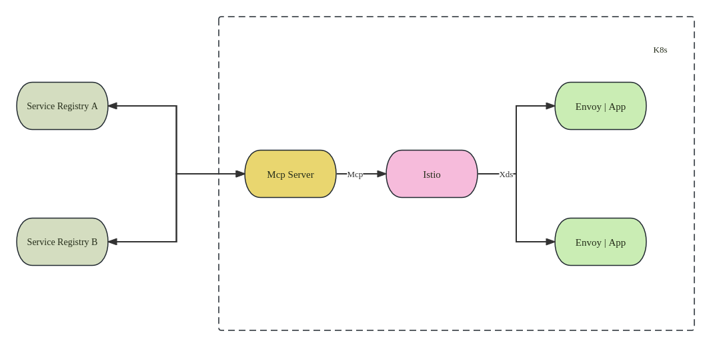
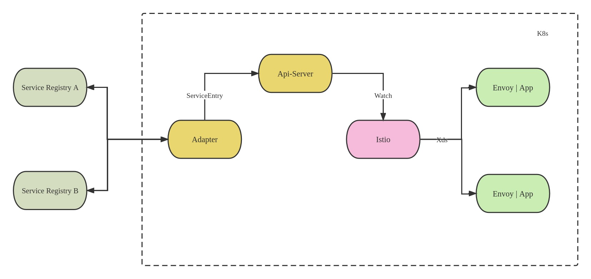
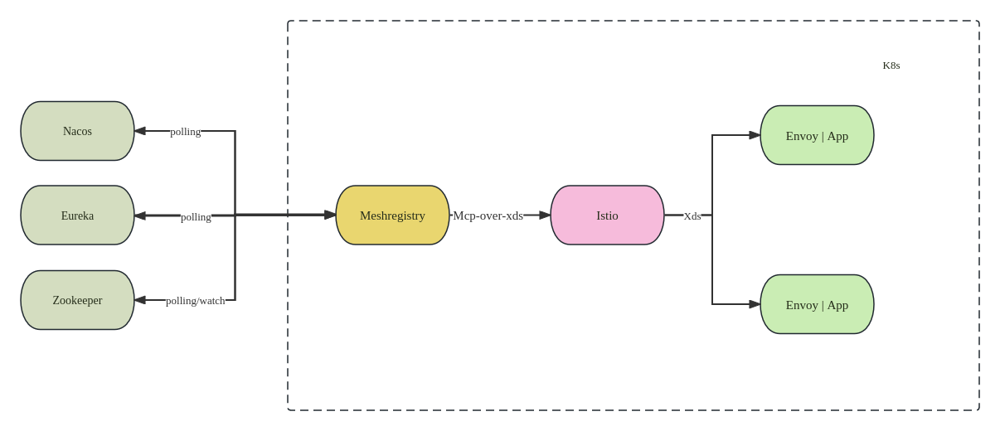
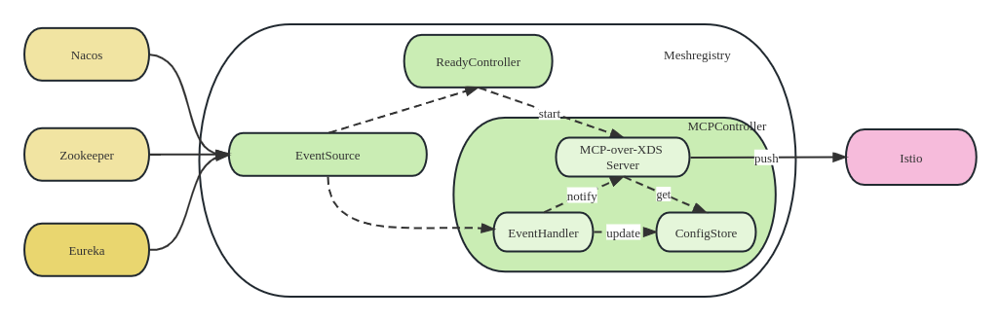
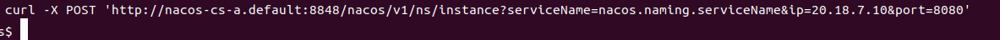
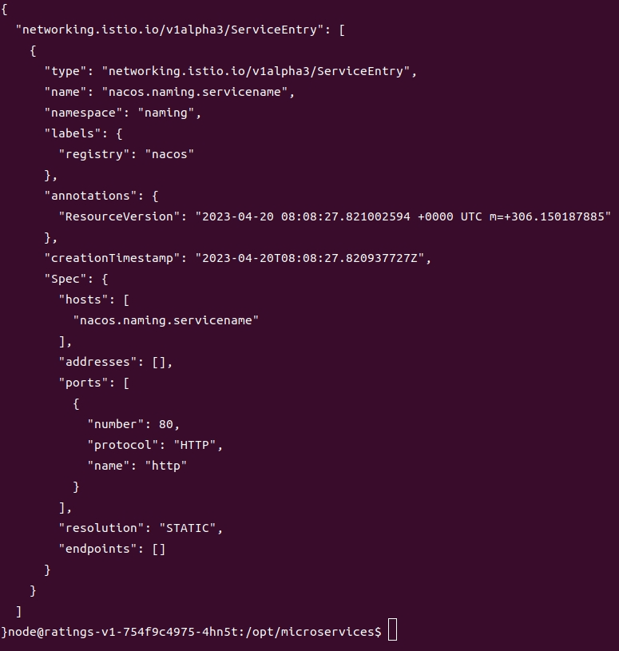
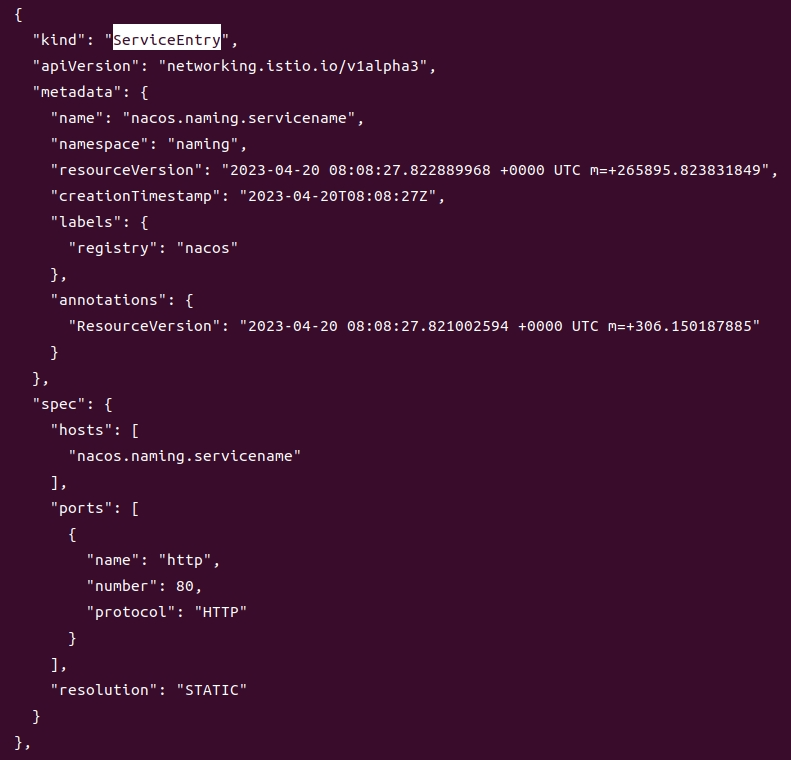

## 背景
服务发现是微服务治理的核心环节。在传统的微服务架构中，采用Consumer/Provider模式，Provider将服务信息注册到注册中心，Consumer通过注册中心发现Provider的服务信息。

在云原生服务网格体系中，服务发现由控制面Istio完成。Istio以内置方式实现了Kubernetes、Eureka等注册中心的适配器，并通过适配器获取各注册中心的服务信息，然后转换成Istio体系的服务模型，推送至数据面Envoy。但随着Istio的演进，对接外部注册中心的代码变得难以维护。在Istio 1.8时，社区移除了内置对接第三方注册中心的适配器代码，只保留了对接Kubernetes注册中心的逻辑。

移除并不意味不再支持，Istio给出的方案是MCP以及后续的Mcp-over-xds协议。用户可以实现自己的Mcp(Xds) Server，其主要包含两个功能：

- 对接第三方服务注册中心，获取服务信息
- 将服务信息转换成Istio ServiceEntry, 并通过Mcp(Mcp-over-xds)协议下发至Istio

还存在另一种方式进行第三方注册中心服务的对接，实现自己的Adapter, 其主要包含两个功能：

- 对接第三方服务中心，获取服务信息
- 将服务信息转换成成Istio ServiceEntry, 并提交至ApiServer

## 架构
网易数帆轻舟微服务团队在服务网格的落地实践过程中发现，大量用户只是将Kubernetes作为部署和管理的平台，服务信息依旧注册在第三方服务注册中心，如Nacos和Zookeeper。因此我们必须解决对接第三方注册中心的问题，才能帮助这些服务接入服务网格。

对比了上面的两种对接第三方服务注册中心的方案，Mcp Server模式的优势是采用Mcp-over-xds协议，性能优于调用Api-Server接口，但是实现的复杂度较高；Adapter模式的的优势是相对简单，但是会大量请求Api-server，性能较差且增加Api-Server的压力。 因此我们选择实现自己的Mcp (Mcp-over-xds) Server - Meshregistry，并且将其开源。

针对客户场景大量使用的Nacos, Zookeeper, Eureka这一现状，Meshregistry已经实现了以上三种服务注册中心的对接。

## 实现
Meshregistry主要实现了以下功能：

- 获取服务信息

  Meshregistry目前适配了Nacos, Zookeeper, Eureka三个注册中心。其中Zookeeper既支持Polling方式（轮询）也支持Watch方式同步服务信息，Eureka和Nacos支持Polling方式获取服务信息。

- 模型转换

  EventSource在获取服务信息后，由于各个服务注册中心的服务模型不一致，所以需要将各自服务模型转换成Istio服务模型ServiceEntry, 并产生一条Event事件。Event事件会创建、更新、删除内存中的ServiceEntry数据，同时通知Mcp-over-xds Server有服务信息变更。

- 推送数据

  Mcp-over-xds Server获取服务变更请求后，会对内存中的ServiceEntry进行实时计算，并通过Xds协议将数据推送到Istiod。在该过程中，我们实现了语义上的增量推送。原先场景下，服务注册中心一个实例的上下线，将会触发Mcp-over-xds Server中的全部ServiceEntry的推送。实现增量推送后，只会触发这个实例对应的ServieEntry的推送，该优化极大减少了Xds推送量，提升整个网格的性能。

## 使用样例
下发以下资源，对接Nacos服务注册中心的Meshregistry模块（前提是已经部署了slimeboot）具体配置可参考 Slime 安装。安装成功后，会在mesh-operator下出现meshregistry的deployment

在Istio的ConfigMap中，给Istio配置ConfigSource，数据源为我们的的Meshregistry服务

手动将服务注册至Nacos

查询Meshregistry的':8081/meshregistry/xdsCache'接口，获取刚注册的服务信息

查询 Istiod的'15014:debug/configz'接口，获取刚注册的服务信息

## 社区
欢迎认领issue: https://github.com/slime-io/slime/issues
欢迎加入 Slime 社区群，及时了解更多 Slime 动向：
微信群： 请添加微信号 yonka_hust 进群(备注: slime)
其他有用的信息可以查阅我们的官网 Slime-Home